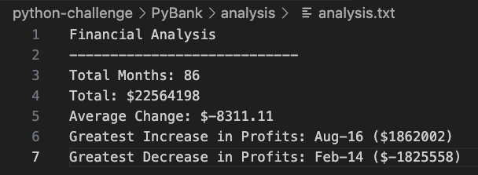
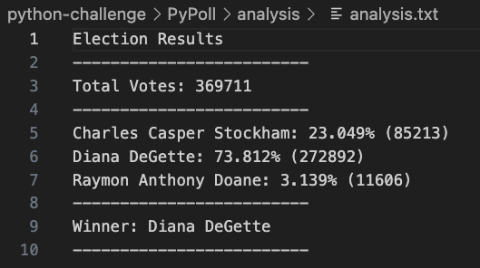

# python-challenge
## Module 3 Challenge

### 
Part 1  |  PyBank
 

In this Challenge, you are tasked with creating a Python script to analyze the financial records of your company. You will be given a financial dataset called budget_data.csv. The dataset is composed of two columns: "Date" and "Profit/Losses".  
 
Your task is to create a Python script that analyzes the records to calculate each of the following values:
* The total number of months included in the dataset
* The net total amount of "Profit/Losses" over the entire period
* The changes in "Profit/Losses" over the entire period, and then the average of those changes
* The greatest increase in profits (date and amount) over the entire period
* The greatest decrease in profits (date and amount) over the entire period  
   

The final script should also both print the analysis to the terminal and export a text file with the results.  
 

<ins>Final Script Outputs</ins>:   

 
 

### 
Part 2  |  PyPoll

In this Challenge, you are tasked with helping a small, rural town modernize its vote-counting process. 
You will be given a set of poll data called election_data.csv. The dataset is composed of three columns: "Voter ID", "County", and "Candidate".  
 
Your task is to create a Python script that analyzes the votes and calculates each of the following values:
* The total number of votes cast
* A complete list of candidates who received votes
* The percentage of votes each candidate won
* The total number of votes each candidate won
* The winner of the election based on popular vote  
   

In addition, your final script should both print the analysis to the terminal and export a text file with the results.  
   

<ins>Final Script Outputs</ins>:   

   
 

### 
References

Data for this dataset was generated by edX Boot Camps LLC, and is intended for educational purposes only.  📚  
 
 
 
      
